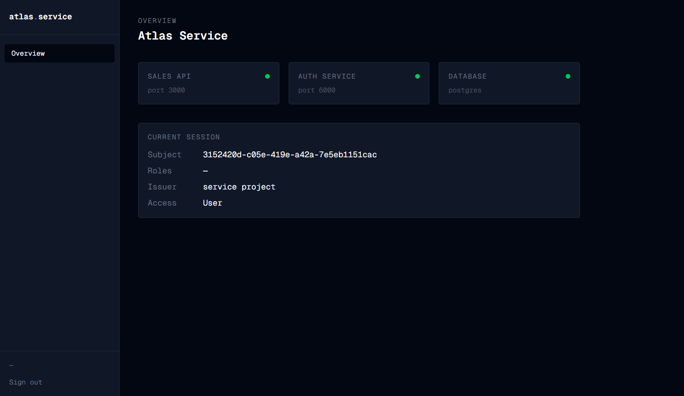

# Atlas Service

**Atlas Service** is a data-oriented domain-driven production-grade service designed to explore real-world service architecture, authentication, observability, and Kubernetes-based deployment. It has no frameworks, no magic; two microservices (sales and authentication), a Next.js frontend, and a full Kubernetes deployment on a local kind cluster.

The project demonstrates how modern Go services are structured, secured, observed, and deployed in a distributed environment. It is built as a learning project with [ardanlabs/service](https://github.com/ardanlabs/service).

---
 

 
---

## What I Built
 
Most Go projects reach for Gin or Echo framework and call it a day. This one doesn't. Every layer — the HTTP router, middleware chain, error handling, context propagation — is written explicitly so I understand exactly what runs on every request.
 
The result is a system I can reason about completely: from a TCP connection arriving at the server, through middleware, down into domain logic, into SQL, and back out as JSON.
 
---

## Architecture
 
```
┌─────────────────────────────────────────────┐
│              kind Cluster                   │
│                                             │
│  ┌──────────┐     ┌──────────────────────┐  │
│  │  client  │────▶│     sales :3000     │  │
│  │ Next.js  │     │                      │  │
│  │  :3001   │     │  users / products    │  │
│  └──────────┘     │  homes / vproducts   │  │
│                   └──────────┬───────────┘  │
│                              │              │
│              ┌───────────────┼──────────┐   │
│              │               │          │   │
│       ┌──────▼──────┐  ┌────▼─────┐    │    │
│       │    auth     │  │ Postgres │    │    │
│       │   :6000     │  │  :5432   │    │    │
│       │  JWT + OPA  │  │          │    │    │
│       └─────────────┘  └──────────┘    │    │
└─────────────────────────────────────────────┘
```
 
**Sales** handles business domains — users, products, homes. It delegates all token validation to the auth service.
 
**Auth** is a dedicated authentication service. It signs and validates RSA JWTs, with authorization rules written in Rego and evaluated by Open Policy Agent.
 
---

## Layered Architecture
 
Every file has one job. Layers only import downward — nothing in `business/` knows about HTTP, nothing in `foundation/` knows about business rules.
 
```
api/          HTTP handlers, middleware, routing
app/          Use cases, request/response translation
business/     Pure domain logic — no HTTP, no SQL
foundation/   Logger, web primitives, keystore, validation
```

**Request lifecycle:**

```
POST /users
  └── Logger       — structured log with trace ID
  └── Errors       — centralized error → HTTP status mapping
  └── Metrics      — request counters via expvar
  └── Panics       — recover panics, return 500
  └── Authenticate — validate JWT via auth service
  └── Authorize    — OPA policy evaluation
  └── handler      — decode + validate request body
  └── userapp      — translate HTTP types → domain types
  └── userbus      — enforce business rules
  └── userdb       — SQL query against Postgres
```

---

## Notable Design Decisions

**Custom HTTP framework** — a thin layer over `net/http`. Handlers return `error`, every request gets a UUID trace ID in context, and middleware chains are explicitly composed per route.

**Domain isolation via delegate pattern** — business domains never import each other. Cross-domain side effects go through an event bus. When a user is deleted, `userbus` fires a `user/deleted` event — `homebus` and `productbus` react independently.

**OPA for authorization** — authorization rules live in Rego policy files, not Go code. `rule_admin_or_subject` means an admin can act on any user, but a regular user can only act on themselves. 

**RSA JWT with key rotation** — auth loads RSA key pairs from disk, keyed by UUID (KID). The KID is embedded in the JWT header so the verifier always knows which public key to use — enabling key rotation without invalidating existing tokens.

**Explicit dependency injection** — no globals. Every dependency flows from `main.go` → `all.go` → handlers. The composition root makes every dependency relationship visible in one place.

---

## 📦 Tech Stack

| | |
|---|---|
| Language | Go 1.25 |
| HTTP | `net/http` (custom framework) |
| Database | PostgreSQL 18 + sqlx |
| Migrations | ardanlabs/darwin |
| Auth | RSA JWT + Open Policy Agent (Rego) |
| Config | ardanlabs/conf (env-var driven) |
| Frontend | Next.js 16, TypeScript, Tailwind CSS |
| Containers | Docker — multi-stage builds, Alpine, non-root |
| Orchestration | Kubernetes via kind + kustomize |
| Logging | Structured JSON (slog-based, trace ID on every line) |
| Metrics | expvar + expvarmon + statsviz |

---
 
## Running Locally
 
### Prerequisites
 
Docker, kind, kubectl, kustomize, Go 1.25+, Node 20+
 
### Start everything
 
```bash
make dev-gotooling   # install Go tools
make dev-docker      # pull images
 
make dev-up          # create kind cluster
make build           # build Docker images
make dev-load-db     # load postgres into kind
make dev-load        # load service images
make dev-apply       # deploy to cluster
```

### Verify
 
```bash
make dev-status
```
 
```
sales-system   auth-xxx     1/1   Running
sales-system   client-xxx   1/1   Running
sales-system   database-0   1/1   Running
sales-system   sales-xxx    1/1   Running
```
 
Open `http://localhost:3001` → login with `admin@example.com / gophers`

---

### Endpoints

| Method | Path | Access |
|--------|------|--------|
| `GET` | `/users` | Admin |
| `GET` | `/users/{id}` | Admin or self |
| `POST` | `/users` | Admin |
| `PUT` | `/users/{id}` | Admin or self |
| `PUT` | `/users/role/{id}` | Admin |
| `DELETE` | `/users/{id}` | Admin or self |
| `GET` | `/products` | Admin |
| `GET` | `/homes` | Admin |
| `GET` | `/liveness` | Public |
| `GET` | `/readiness` | Public |

---
 
## References
 
- [ardanlabs/service](https://github.com/ardanlabs/service) — Bill Kennedy's production Go service pattern
- [Open Policy Agent](https://www.openpolicyagent.org/) — policy engine for authorization
- [kind](https://kind.sigs.k8s.io/) — Kubernetes in Docker
---